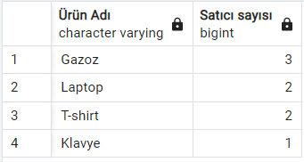

# _SQL Örnekleri_

> Ürünler tablosuna ürün eklemek;

`insert into products (name,unit_price,stock) 
values ('Mouse', 500,20)`

> Ürünler tablosunda ürün güncellemek;

`update products set unit_price=250 where name='Mouse'`
 

> ürünler tablosunda ürün silmek;

`delete from products where name='Mouse'`

> Belirli sınırlar arasındaki kayıtları getirmek;

`select * from products where cast(unit_price as numeric)
between 100 and 400`

Fiyat aralığı 100 ile 400 olan ürünler

> Birden fazla 'Where' işlemini tek seferde yapmak;

`select ci.name as "Şehir Adı", co.name as "Ülke Adı" from cities ci
inner join countries co on ci.country_id=co.id
where lower(co.name) in('almanya','hollanda') `

Ülkesi 'Almanya' veya 'Hollanda' olan şehirler

> Birbirleri ile bağlantılı tabloları ve kayıtlarını getirmek (İnner Join);

`select pr.name as "Ürün Adı", ca.name as "Kategori Adı" from product_categories pc
inner join products pr
on pc.product_id = pr.id
inner join categories ca
on pc.category_id = ca.id`

Ürünler ve bağlı oldukları kategori bilgisi.

> Birbirleri ile bağlantılı tabloları ve kayıtlarını getirmek (Left Join);

`select * from products pr
left join product_suppliers ps
on pr.id = ps.product_id where ps.supplier_id is null`

Satıcı olmayan ürünlerin bilgisi.

>Birbiriyle bağlantılı verileri gruplayabilmek;

`select pr.name as "Ürün Adı", count(ps.supplier_id) as "Satıcı sayısı" from products pr
inner join product_suppliers ps on pr.id=ps.product_id
group by pr.name order by count(ps.supplier_id) desc`

Ürün adı ve satıcı sayısını azalan şekilde getirilmesi.

